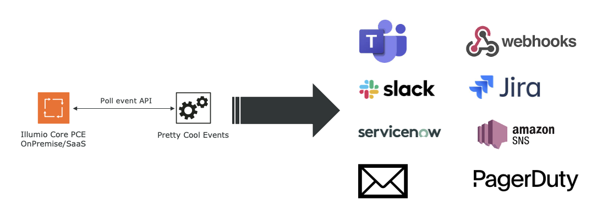

# illumio-pretty-cool-events

Illumio Pretty Cool Events aims to be a general notification mechanism that polls
the Illumio Core Events API to get the latest audit events from the Illumio Core PCE.

It will then call plugin actions based on a user configuration (config.yaml).

# Installation

    pip install -r requirements.txt

Create your config file as specified in the [Configuration](#Configuration) section.

    ./pretty-cool-events --config config.yaml

## Running it via docker

A docker image is available via Github Container Registry and can be run via docker or kubernetes.

# Configuration

Configuration is done via a YAML config file, find a sample file in the
config.yaml.sample in the base directory.

## Config file sections

### config

Global configuration

List of keys:

* pce - the pce fqdn
* pce_api_user - the pce api key user (api_xyz1234...)
* pce_api_secret - the pce api key secret
* pce_org - the pce org
* pce_poll_interval - the number of seconds between checking for events
* httpd - run the builtin flask httpd (default: no, don't use in production)
* httpd_listener_address - IP which httpd listens on
* httpd_listener_port - Port for httpd listener
* default_template - the default template to use in output plugins

#### plugin_config

Inside config you can configure each of the plugins

### watchers

Section to specify watchers. Watchers are event types pretty-cool-events should listen to.

Each event type in the PCE and wildcard event types can have one or more watchers.
The example in config.yaml.example will configure 3 watchers for the user.login event to go
to Slack, Mail and SNS/SMS.

# Available plugins (Work in progress)

* PCEStdout  - directly output events to stdout
* PCEMail    - email specific events
* PCESlack   - send to a slack channel or person
* PCESNS     - send SMS/text messages via Amazon SNS
* PCESyslog  - useful for SaaS instances or PoCs, poll the event API and send to syslog
* PCEWebhook - send custom webhooks (needs more work)
* PCEJira    - open a ticket in a jira project (especially useful for provisioning changes quickly)
* PCETeams   - create a message via Teams Connectorcard
* PCEServiceNow - create an incident in the ServiceNow incident table

## PCEStdout

## PCEMail

### Configuration

* PCEMail: 
  * smtp_host: smtp_host with optional portnumber
  * smtp_user: smtp_username
  * smtp_password: smtp_password
  * smtp_port: smtp_port
  * email_to: default email to send to

## PCESNS

### Configuration

* PCESNS
  * access_key - aws access key for SNS service
  * access_key_secret - aws access key secret for SNS service
  * aws_region_name - aws region name (e.g. eu-central-1)
 
## PCEJira

### Configuration

* PCEJira:
  + jira_server - url of jira server
  + username - jira user name
  + api_token - api_token of user
  + project - the jira project to post to
   
## PCEServiceNow

This plugin will create an incident in the SNOW incidents table. Currently no other tables
are configurable, fields are fixed, initial working dummy, more work to do.

### Configuration

* PCEServiceNow:
  + instance - snow instance
  + username - SNOW user name
  + password - password
   
## PCESlack

### Configuration

* PCESlack
  + template - default-slack.html
  + slack_bot_token: token

## PCETeams

### Configuration

* PCETeams
  + webhook: Webhook URL (https://docs.microsoft.com/en-us/microsoftteams/platform/webhooks-and-connectors/how-to/add-incoming-webhook)
  + template: the template to use for this message/connector card

## PCESyslog

This is not in a good state and might be working or not.

### Configuration

* PCESyslog
  +  syslog_host: host to send syslog to
  +  syslog_port: syslog port
  +  template: template to use for sending syslog
  +  syslog_cert_file: TLS cert file

# Plugin architecture

Plugins can have a config block in the global config file, the config block
should have the same name as the Plugin class On init the config section under
the plugin class name is handed over to the plugins config method

# Template support

Every plugin inherits from OutputPlugin, which creates a jinja2 environment
that has a filesystem loader based on the templates directory.
That means any plugin can rely to load templates from the templates directory.

    template = self.env.get_template('filename')

You can then render the template with the event being handed over by the main
loop

    template.render(output)

# Templates included

* default.html - default template
* default-slacks.html - a slack BlockKit template to make for fancier slack notifications.
* sms.tmpl - Send SMS with the event and a link to the Illumio Core PCE UI
* email.tmpl - standard email template

# How to write your own plugin

* create a new plugin under plugins
* be sure to import outputplugin for the basic functionality
* populate your own methods with code

    class <YourPlugin>(OutputPlugin):
        def config(self,config):
        def output(self,config):

# Known issues

* python creates insecure request warnings if your certificates are not
  official or trusted. You can circumvent by setting export
PYTHONWARNINGS="ignore:Unverified HTTPS request"

# TODO

* Dockerfile for easy deployment - halfway complete
* throttling of specific event types
* plugins can indicate what is valid configuration for them (mandatory/optional)
* config checks

# Ideas

* Plugin to execute local actions - e.g. git commit policy after each PCE provision
* Notify people on slack for problems in the PCE or process
* Get policy and check for constraints
* Do something useful with tampering events
* etc.
